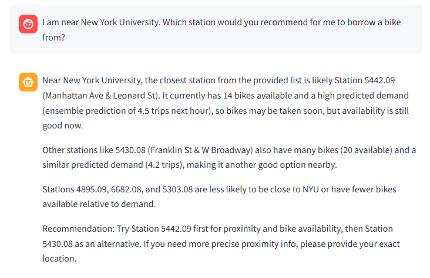
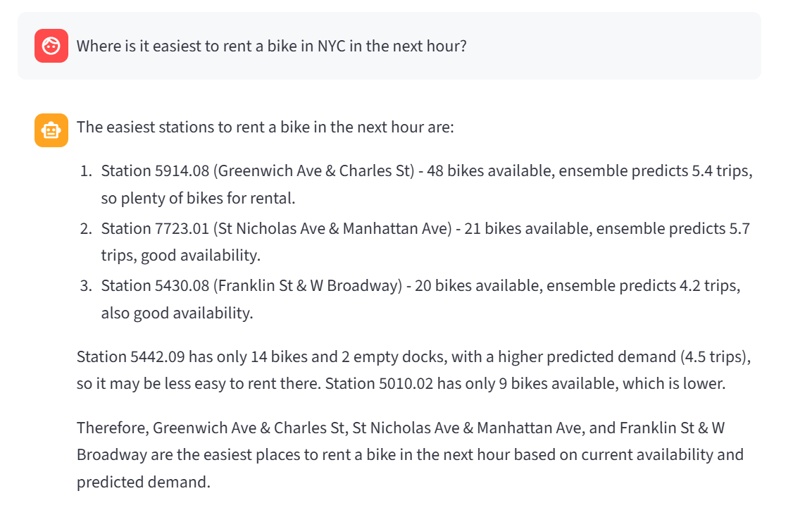

# ID2223-Project
# 🚲 Citibike Intelligent Assistant  
*Real-time bike demand prediction + RAG + LLM Chat UI*

> Course project for **ID2223 – Scalable Machine Learning and Deep Learning Systems** @ KTH.

You can use our UI here: https://huggingface.co/spaces/yunquan01/ID2223-Project

---

## 1. Project Overview

This repo contains the code for my end-to-end **Citibike intelligent assistant**:

- Pulls **real-time Citibike station status** from the official GBFS API.
- Uses **Hopsworks Feature Store** (offline + online feature groups) and a **Random Forest model with lag features** to predict **next-hour demand for each station**.
- Combines historical model predictions with **current bikes / docks availability** into an **ensemble prediction**.
- Builds a **RAG (Retrieval-Augmented Generation)** index over the latest prediction CSV (plus optional documentation).
- Wraps everything in a **chat UI** powered by an LLM (OpenAI), deployed as a **Hugging Face Space**.

Users can ask questions such as:

- *“Where is the best place to rent a bike in Manhattan in the next hour?”*  
- *“I’m near Greenpoint – which nearby stations will likely have bikes available?”*  
- *“Which stations will be the busiest in the next hour?”*

…and get answers grounded in the **latest predictions + external docs**, not just the LLM’s prior knowledge.

---

## 2. System Architecture

### 2.1 Data & Feature Store

1. **Historical trip data (offline)**  
   - Source: Citibike monthly tripdata CSV (e.g., `202509-citibike-tripdata_1.csv` and many other tripdata CSV files for Sep 2025, because the data of Sep 2025 is very complete and it is close to the current time).  
   - Processed into an **offline feature group** in Hopsworks: `citibike_hourly_station` (v2).  
   - Main columns:
     - `start_station_id`
     - `started_hour` / `event_time`
     - `hour`, `dow` (day of week), `is_weekend`
     - `lag_1h`, `lag_24h` (previous demand)
     - `trips_per_hour` (label)

2. **Real-time station status (online)**  
   - Source: Citibike GBFS `station_status.json`.  
   - Ingested into an **online feature group** in Hopsworks:  
     `citibike_hourly_station_online` (v1).  
   - Main columns:
     - `start_station_id` (GBFS station id, later mapped to offline numeric id)
     - `event_time`
     - `hour`, `dow`, `is_weekend`
     - `num_bikes_available`, `num_docks_available`

3. **Station id mapping**  
   - Script `build_station_id_mapping.py` builds a mapping:
     - `start_station_id` (offline numeric id from tripdata)
     - `gbfs_id` (online UUID from GBFS)
   - Saved as `station_id_mapping.csv`, used to join online and offline worlds.

---

### 2.2 Demand Prediction Model

The core prediction model is a **Random Forest Regressor** trained on **5 historical features**:

```text
hour, dow, is_weekend, lag_1h, lag_24h  ->  trips_per_hour
```
---
### 2.3 Real-time Ensemble with Bikes/Docks

At prediction time we:

1. Use the RF model to predict **historical demand** for the next hour:

   ```python
   y_hist = model.predict([hour, dow, is_weekend, lag_1h, lag_24h])
   ```

2. Read the latest **online features** (`num_bikes_available`, `num_docks_available`) from the online FG, mapped to offline station ids.

3. Compute a simple **occupancy-based heuristic**:

   * `capacity = bikes + docks`
   * `occ_ratio = bikes / capacity`
   * Scale `occ_ratio` so that its mean matches `mean(y_hist)` → a rough **real-time demand signal** `y_rt`.

4. Combine them into a **40 / 60 ensemble**:

   ```python
   y_final = 0.4 * y_hist + 0.6 * y_rt
   ```

5. Save all results into a CSV, e.g.

   ```text
   predictions_with_lag_next_hour_all_stations_ensemble.csv
   ```

Each row contains:

* `start_station_id`, `start_station_name`
* `num_bikes_available`, `num_docks_available`
* `lag_1h`, `lag_24h`
* `predicted_trips_hist` (model only)
* `predicted_trips_realtime` (occupancy heuristic)
* `predicted_trips_ensemble` (final score)

---

### 2.4 RAG (Retrieval-Augmented Generation)

To make the LLM **grounded in the latest predictions**, we:

1. **Build a vector index** (FAISS) over per-station texts derived from the prediction CSV, using `build_rag_index.py`.
   Example idea:

   ```python
   # Convert each row into a short description string
   text = (
       f"Station {row.start_station_id} ({row.start_station_name}) "
       f"is predicted to have {row.predicted_trips_ensemble:.1f} trips next hour, "
       f"with {row.num_bikes_available} bikes and "
       f"{row.num_docks_available} docks available."
   )
   ```

   * Encode with SentenceTransformers (e.g. `all-MiniLM-L6-v2`).
   * Store embeddings + metadata in a FAISS index on disk (e.g. `rag_index/`).

2. Optionally add extra text documents (e.g. explanation of the model, how to interpret the predictions).

3. At query time, `bike_agent.py`:

   * Embeds the user question.
   * Retrieves top-k relevant stations/docs from FAISS.
   * Builds a **RAG context** (short snippets).
   * Calls the LLM with a system prompt that forces it to **answer based on the retrieved context**, not hallucinate.

---

### 2.5 LLM Agent & Web UI

* **LLM**: OpenAI GPT model (via `OPENAI_API_KEY`).

* **Agent**: Implemented in `bike_agent.py`, responsible for:

  * Handling retrieval from FAISS index.
  * Formatting the context and user question.
  * Returning a natural-language response + (optionally) station table snippets.

* **UI**: Implemented in `app.py` using Gradio (or Streamlit).

  * Two **run modes**:

    1. **Always refresh predictions & index** – slower but always uses the very latest GBFS + Hopsworks data.
    2. **Reuse existing index** – faster chat experience, using the latest pre-computed CSV & index.

  * Typical workflow for one user question:

    1. (Optionally) run `feature3_ingest_online.py` + `feature6_predict_next_hour_with_lag_all_stations.py` to recompute predictions.
    2. Rebuild / load RAG index via `build_rag_index.py`.
    3. Call `bike_agent.answer(question)` and stream the result to the chat UI.

The UI is deployed as a **Hugging Face Space**

---

## 3. Repository Structure

```text
.
├── app.py                                # Web UI (Gradio / Streamlit)
├── bike_agent.py                         # RAG + LLM agent
├── build_rag_index.py                    # Build FAISS index from predictions CSV
├── build_station_id_mapping.py           # Build offline-id <-> GBFS-id mapping (local)
├── feature3_ingest_online.py             # Ingest GBFS into online FG on Hopsworks
├── feature6_predict_next_hour_with_lag_all_stations.py
│                                         # End-to-end pipeline: offline+online FG -> ensemble predictions CSV
├── station_id_mapping.csv                # Precomputed mapping (can be rebuilt)
└── README.md
```

> Note: Training scripts for the RF model (e.g. `feature5_train_with_lag.py`) and earlier notebooks are kept locally but described in this README for completeness.

---

## 4. Example Queries

Here are some example questions the assistant can answer:

* **“Which stations in Manhattan will be the busiest in the next hour?”**
* **“I am near Greenpoint; where should I go if I definitely want to find a bike?”**
* **“Show me the top 5 stations with highest predicted demand and explain why.”**
* **“Is there any station around Central Park that is predicted to be very quiet?”**

Behind the scenes, the agent:

1. Retrieves relevant station rows from the prediction CSV via FAISS.
2. Constructs a context with station names, bikes/docks, and predicted trips.
3. Asks the LLM to answer *only* using that context, with explanations.

---

## 5. How This Meets the Course Requirements

* ✅ **Non-trivial data source**
  Uses historical Citibike tripdata + real-time GBFS station status.

* ✅ **Feature store usage (Hopsworks)**
  Offline FG for historical features and labels; online FG for real-time station status.

* ✅ **ML model with engineering**
  Random Forest with time features and lag features (`lag_1h`, `lag_24h`), evaluated with MAE/RMSE.

* ✅ **Real-time inference + feature engineering**
  Regularly pulls GBFS, writes to online FG, and merges with offline lag features.
  Ensemble of historical model prediction and real-time occupancy.

* ✅ **RAG + LLM**
  FAISS index over prediction CSV (+ docs).
  LLM agent that answers questions grounded in retrieved evidence.

* ✅ **Web UI / Deployment**
  Gradio/Streamlit app (`app.py`) deployed as a Hugging Face Space.
  Users can interactively query the system in natural language.

---

## 6. Limitations & Future Work

* Ensemble is a **simple heuristic**; could be improved with a learned model combining more features.
* Only uses **one month** of tripdata; adding more months could improve robustness.
* RAG currently focuses on **next-hour prediction**; could be extended to multi-hour or route planning questions.
* No explicit handling of **special events / weather**, which are known to affect bike demand.

---

## 7. Brief Description (Summary)

This project implements a **Citibike Smart Assistant**:

* It reads historical features (including `lag_1h` / `lag_24h`) from the **Hopsworks feature store**, and uses a Random Forest model to predict next-hour demand for each station;
* It pulls real-time `num_bikes_available` / `num_docks_available` from **Citibike GBFS**, builds an occupancy-rate feature, and performs a **40/60 fusion** with the historical model;
* It turns the latest round of prediction results (CSV) into a **RAG index (FAISS + SentenceTransformer)**;
* It uses an **OpenAI LLM** for Q&A, and interacts with users via a Web UI (Hugging Face Space), allowing natural-language questions like “Where is the best place to rent a bike in the next hour?” and “Which stations will be the busiest?”

## 8. Results

We record some of our results here:





